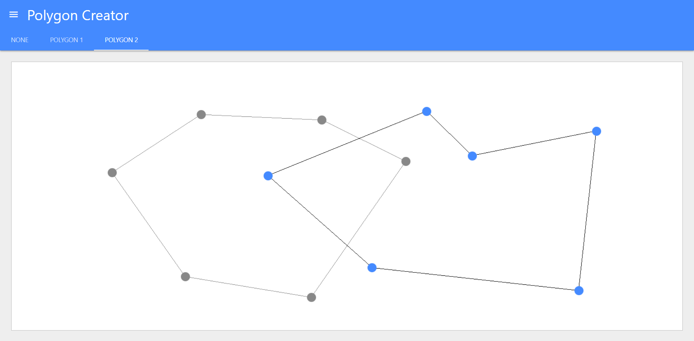
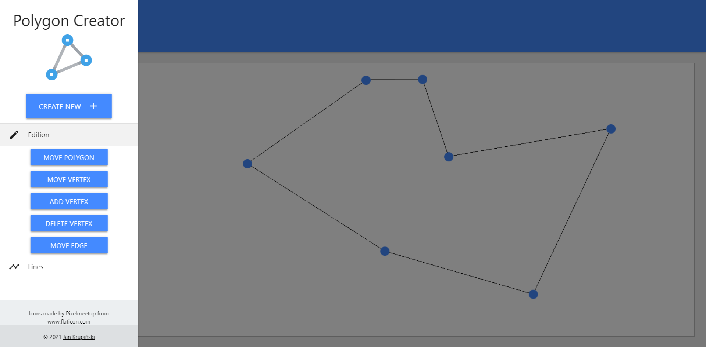

# Polygons Creator

App for creating polygons using Bresenham's line algorithm

## Website

[Website](https://krupinskij.github.io/polygons-creator/)

## Installation

Download or clone repository

Run

```bash
# installing dependances
$ npm install
```

## Running the app

```bash
# development
$ npm run build

# watch mode
$ npm run watch
```

## Configuration

In [materialize.config.scss](./theme/materialize.config.scss) you can change default theme colors according to
materialize-css [colour palette](https://materializecss.com/color.html).

## Homepage view

 
